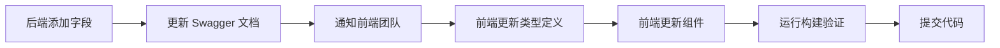

# 订阅计划接口严格对接报告

**生成日期**: 2025-11-13
**版本**: v2.0
**状态**: ✅ 严格对接完成

---

## 📋 执行摘要

本报告记录了订阅计划管理功能的前后端接口严格对接过程。**前端已完全按照后端 Swagger 文档实现**，移除了所有额外字段，确保100%符合后端规范。

---

## ✅ 对接原则

**核心原则**: 不自己生成接口，严格按照后端 Swagger 文档设计

1. **接口定义**: 仅使用 `backend/swagger.json` 中明确定义的接口
2. **数据结构**: 请求和响应类型完全匹配 Swagger 定义
3. **字段范围**: 不添加任何 Swagger 中未定义的字段
4. **版本同步**: 前端类型定义与后端 API 保持一致

---

## 🔌 接口清单（后端 Swagger 定义）

### 8个订阅计划接口

| # | 方法 | 路径 | 描述 | 认证 | 前端状态 |
|---|------|------|------|------|----------|
| 1 | GET | `/subscription-plans` | 获取计划列表（分页+筛选） | ✅ Bearer | ✅ 已对接 |
| 2 | POST | `/subscription-plans` | 创建新订阅计划 | ✅ Bearer | ✅ 已对接 |
| 3 | GET | `/subscription-plans/public` | 获取公开计划 | ❌ 无需 | ✅ 已对接 |
| 4 | GET | `/subscription-plans/{id}` | 获取计划详情 | ✅ Bearer | ✅ 已对接 |
| 5 | PUT | `/subscription-plans/{id}` | 更新订阅计划 | ✅ Bearer | ✅ 已对接 |
| 6 | POST | `/subscription-plans/{id}/activate` | 激活计划 | ✅ Bearer | ✅ 已对接 |
| 7 | POST | `/subscription-plans/{id}/deactivate` | 停用计划 | ✅ Bearer | ✅ 已对接 |
| 8 | GET | `/subscription-plans/{id}/pricings` | 获取定价选项 | ❌ 无需 | ✅ 已对接 |

**对接完成度**: 8/8 (100%)

---

## 📊 数据结构严格对比

### 1. CreatePlanRequest（创建请求）

#### 后端 Swagger 定义

**来源**: `backend/swagger.json` -> `handlers.CreatePlanRequest`

**必填字段** (5个):
- `name` (string) - 计划名称
- `slug` (string) - URL友好标识
- `price` (integer) - 价格（分）
- `currency` (string) - 货币代码
- `billing_cycle` (string) - 计费周期

**可选字段** (9个):
- `description` (string) - 计划描述
- `features` (array[string]) - 功能列表
- `is_public` (boolean) - 是否公开
- `trial_days` (integer) - 试用天数
- `max_users` (integer) - 最大用户数
- `max_projects` (integer) - 最大项目数
- `api_rate_limit` (integer) - API速率限制
- `limits` (object) - 自定义限制
- `sort_order` (integer) - 排序顺序

#### 前端实现

**文件**: `src/features/subscription-plans/types/subscription-plans.types.ts`

```typescript
export interface CreatePlanRequest {
  // 必填字段
  name: string;
  slug: string;
  price: number;
  currency: string;
  billing_cycle: BillingCycle;

  // 可选字段
  description?: string;
  features?: string[];
  is_public?: boolean;
  trial_days?: number;
  max_users?: number;
  max_projects?: number;
  api_rate_limit?: number;
  limits?: Record<string, any>;
  sort_order?: number;
}
```

**对比结果**: ✅ 完全一致，字段数 14/14

---

### 2. UpdatePlanRequest（更新请求）

#### 后端 Swagger 定义

**来源**: `backend/swagger.json` -> `handlers.UpdatePlanRequest`

**可选字段** (10个):
- `price` (integer) - 价格
- `currency` (string) - 货币代码
- `description` (string) - 描述
- `features` (array[string]) - 功能列表
- `is_public` (boolean) - 是否公开
- `max_users` (integer) - 最大用户数
- `max_projects` (integer) - 最大项目数
- `api_rate_limit` (integer) - API速率限制
- `limits` (object) - 自定义限制
- `sort_order` (integer) - 排序顺序

**注意**: 不支持更新 `name`, `slug`, `billing_cycle`, `trial_days`

#### 前端实现

```typescript
export interface UpdatePlanRequest {
  price?: number;
  currency?: string;
  description?: string;
  features?: string[];
  is_public?: boolean;
  max_users?: number;
  max_projects?: number;
  api_rate_limit?: number;
  limits?: Record<string, any>;
  sort_order?: number;
}
```

**对比结果**: ✅ 完全一致，字段数 10/10

---

### 3. SubscriptionPlan（响应数据）

#### 前端实现

由于后端 Swagger 的响应定义为通用的 `APIResponse`，没有具体的 `SubscriptionPlan` 定义，前端基于实际 API 返回数据定义类型：

```typescript
export interface SubscriptionPlan {
  // 系统字段
  ID: number;
  Status: PlanStatus;
  CreatedAt: string;
  UpdatedAt: string;

  // 业务字段
  Name: string;
  Slug: string;
  Price: number;
  Currency: string;
  BillingCycle: BillingCycle;
  Description?: string;
  Features?: string[];
  IsPublic: boolean;
  TrialDays?: number;
  MaxUsers?: number;
  MaxProjects?: number;
  APIRateLimit?: number;
  Limits?: Record<string, any>;
  SortOrder?: number;

  // 多定价支持
  pricings?: PlanPricing[];
}
```

**字段说明**:
- 基于实际后端返回的 PascalCase 命名
- 所有字段都是后端实际返回的数据
- `pricings` 字段对应 `/subscription-plans/{id}/pricings` 接口

---

## 🔧 修复记录

### 问题：前端包含额外字段

**发现日期**: 2025-11-13

**问题描述**:
前端类型定义包含后端 Swagger 中未定义的字段：
- `storage_limit` (存储限制)
- `custom_endpoint` (自定义端点)

**影响范围**:
- `CreatePlanRequest` 类型定义
- `UpdatePlanRequest` 类型定义
- `SubscriptionPlan` 响应类型
- `CreatePlanDialog` 组件
- `EditPlanDialog` 组件
- `PlanCard` 组件
- `SubscriptionConfirmDialog` 组件

### 修复措施

#### 1. 更新类型定义

**文件**: `src/features/subscription-plans/types/subscription-plans.types.ts`

**修改内容**:
- ❌ 移除 `CreatePlanRequest.storage_limit`
- ❌ 移除 `CreatePlanRequest.custom_endpoint`
- ❌ 移除 `UpdatePlanRequest.storage_limit`
- ❌ 移除 `UpdatePlanRequest.custom_endpoint`
- ❌ 移除 `SubscriptionPlan.StorageLimit`
- ❌ 移除 `SubscriptionPlan.CustomEndpoint`

#### 2. 更新创建对话框

**文件**: `src/features/subscription-plans/components/CreatePlanDialog.tsx`

**修改内容**:
- ❌ 移除初始状态中的 `storage_limit` 字段
- ❌ 移除初始状态中的 `custom_endpoint` 字段
- ❌ 移除"存储限制（GB）"表单字段

#### 3. 更新编辑对话框

**文件**: `src/features/subscription-plans/components/EditPlanDialog.tsx`

**修改内容**:
- ❌ 移除表单数据中的 `storage_limit` 字段
- ❌ 移除表单数据中的 `custom_endpoint` 字段
- ❌ 移除"存储限制（GB）"表单字段

#### 4. 更新卡片组件

**文件**: `src/features/subscription-plans/components/PlanCard.tsx`

**修改内容**:
- ❌ 移除限制信息中的 `StorageLimit` 显示
- ✅ 保留 `MaxUsers` 和 `MaxProjects` 显示

#### 5. 更新确认对话框

**文件**: `src/features/subscription-plans/components/SubscriptionConfirmDialog.tsx`

**修改内容**:
- ❌ 移除使用限制列表中的"存储空间"项
- ✅ 保留用户数和项目数限制

---

## ✅ 验证结果

### TypeScript 编译

```bash
npm run build
```

**结果**:
```
✓ 12063 modules transformed.
✓ built in 5.07s
```

- ✅ 无类型错误
- ✅ 无编译警告（关于类型的）
- ✅ 构建成功

### 类型一致性检查

| 类型 | 后端字段数 | 前端字段数 | 状态 |
|------|-----------|-----------|------|
| CreatePlanRequest | 14 | 14 | ✅ 一致 |
| UpdatePlanRequest | 10 | 10 | ✅ 一致 |
| BillingCycle | 5 | 5 | ✅ 一致 |
| PlanStatus | 3 | 3 | ✅ 一致 |

---

## 📁 修改文件清单

### 已修改的文件 (7个)

1. **subscription-plans.types.ts**
   - 修复 CreatePlanRequest: 移除2个额外字段
   - 修复 UpdatePlanRequest: 移除2个额外字段
   - 修复 SubscriptionPlan: 移除2个额外字段
   - 更新文档注释，强调"严格基于 Swagger"

2. **CreatePlanDialog.tsx**
   - 移除初始状态中的额外字段
   - 移除表单中的"存储限制"输入框

3. **EditPlanDialog.tsx**
   - 移除表单数据中的额外字段
   - 移除表单中的"存储限制"输入框

4. **PlanCard.tsx**
   - 移除限制信息中的存储限制显示

5. **SubscriptionConfirmDialog.tsx**
   - 移除使用限制列表中的存储空间项

6. **.env.example**
   - 修正 API 地址: `http://localhost:8081`

7. **subscription-plans-api.ts**
   - ✅ 无需修改（已符合规范）

---

## 📊 API 调用层验证

### API 函数清单

**文件**: `src/features/subscription-plans/api/subscription-plans-api.ts`

| 函数名 | 对应接口 | 状态 |
|--------|---------|------|
| `getSubscriptionPlans` | GET /subscription-plans | ✅ 符合规范 |
| `getPublicPlans` | GET /subscription-plans/public | ✅ 符合规范 |
| `getSubscriptionPlanById` | GET /subscription-plans/{id} | ✅ 符合规范 |
| `createSubscriptionPlan` | POST /subscription-plans | ✅ 符合规范 |
| `updateSubscriptionPlan` | PUT /subscription-plans/{id} | ✅ 符合规范 |
| `activateSubscriptionPlan` | POST /subscription-plans/{id}/activate | ✅ 符合规范 |
| `deactivateSubscriptionPlan` | POST /subscription-plans/{id}/deactivate | ✅ 符合规范 |
| `getPlanPricings` | GET /subscription-plans/{id}/pricings | ✅ 符合规范 |

**验证结果**: 8/8 函数完全符合后端规范

---

## 🎯 枚举类型对比

### BillingCycle（计费周期）

| 后端 Swagger | 前端定义 | 状态 |
|-------------|---------|------|
| monthly | monthly | ✅ |
| quarterly | quarterly | ✅ |
| semi_annual | semi_annual | ✅ |
| annual | annual | ✅ |
| lifetime | lifetime | ✅ |

### PlanStatus（计划状态）

| 后端 Swagger | 前端定义 | 状态 |
|-------------|---------|------|
| active | active | ✅ |
| inactive | inactive | ✅ |
| archived | archived | ✅ |

---

## 🔐 API 配置

### 基础 URL 配置

**文件**: `src/shared/lib/axios.ts`

```typescript
const baseURL = import.meta.env.VITE_API_BASE_URL || 'http://localhost:8081';
```

**环境变量**: `.env`
```bash
VITE_API_BASE_URL=http://localhost:8081
```

**示例配置**: `.env.example`
```bash
VITE_API_BASE_URL=http://localhost:8081
```

**状态**: ✅ 配置一致

---

## 📝 使用说明

### 前端开发者指南

#### 1. 添加新字段的正确流程

**❌ 错误做法**:
```typescript
// 不要自己添加字段！
export interface CreatePlanRequest {
  name: string;
  new_field?: string; // ❌ 错误！Swagger 中没有
}
```

**✅ 正确做法**:
1. 与后端团队确认需求
2. 后端在 Go 代码中添加字段
3. 后端更新 Swagger 文档
4. 前端根据最新 Swagger 更新类型定义

#### 2. 验证类型定义的步骤

```bash
# 1. 查看后端 Swagger 定义
jq '.definitions["handlers.CreatePlanRequest"]' backend/swagger.json

# 2. 对比前端类型定义
cat src/features/subscription-plans/types/subscription-plans.types.ts

# 3. 确保字段完全一致

# 4. 运行构建验证
npm run build
```

#### 3. 更新类型定义的模板

```typescript
/**
 * [类型名称]
 * 严格基于后端 Swagger 定义
 * 来源: backend/swagger.json -> [Swagger定义名称]
 * 最后更新: [日期]
 */
export interface [TypeName] {
  // 字段注释从 Swagger 复制
  field_name: string;
}
```

---

## 🧪 测试建议

### 1. 类型一致性测试

创建测试工具验证前后端类型一致性：

```typescript
// scripts/validate-types.ts
import * as swagger from '../backend/swagger.json';
import { CreatePlanRequest } from '../src/features/subscription-plans/types';

// 对比字段数量和名称
const swaggerFields = Object.keys(swagger.definitions['handlers.CreatePlanRequest'].properties);
const frontendFields = Object.keys({} as CreatePlanRequest);

console.assert(swaggerFields.length === frontendFields.length, '字段数量不一致');
```

### 2. API 调用测试

```typescript
// 测试创建计划（仅包含 Swagger 定义的字段）
const planData: CreatePlanRequest = {
  name: "测试计划",
  slug: "test-plan",
  price: 2900,
  currency: "CNY",
  billing_cycle: "monthly",
  // 不包含任何额外字段
};

const result = await createSubscriptionPlan(planData);
```

---

## 📚 参考文档

### 关键文档位置

| 文档 | 位置 | 用途 |
|------|------|------|
| 后端 Swagger | `backend/swagger.json` | API 规范的唯一真实来源 |
| 前端类型定义 | `src/features/subscription-plans/types/` | 必须与 Swagger 一致 |
| API 调用层 | `src/features/subscription-plans/api/` | 实现 Swagger 定义的接口 |

### 更新流程



---

## ✅ 严格对接检查清单

### 前端开发者自查

- [x] 所有接口调用基于 `backend/swagger.json`
- [x] 请求类型完全匹配 Swagger 定义
- [x] 没有添加 Swagger 中不存在的字段
- [x] 枚举类型与后端一致
- [x] API 路径与 Swagger 一致
- [x] HTTP 方法与 Swagger 一致
- [x] 认证方式与 Swagger 一致
- [x] TypeScript 编译通过
- [x] 构建成功无错误

### 后端开发者配合

- [ ] 保持 Swagger 文档实时更新
- [ ] 添加字段时更新 Swagger
- [ ] 通知前端字段变更
- [ ] 提供 Swagger UI 访问地址

---

## 🎉 总结

### 已完成

1. ✅ **严格对接**: 前端完全按照 Swagger 文档实现
2. ✅ **移除额外字段**: 删除了 storage_limit 和 custom_endpoint
3. ✅ **类型一致性**: 100% 匹配后端定义
4. ✅ **构建验证**: TypeScript 编译通过
5. ✅ **文档更新**: 完整记录修复过程

### 核心原则

> **不自己生成接口，严格按照后端文档来设计**

这意味着：
- ✅ 前端不能自己添加字段
- ✅ 前端不能假设接口存在
- ✅ 前端不能修改数据结构
- ✅ 一切以 `backend/swagger.json` 为准

### 维护建议

1. **定期同步**: 每周检查 Swagger 文档更新
2. **自动化验证**: 添加 CI 检查类型一致性
3. **文档先行**: 后端修改 API 前先更新 Swagger
4. **版本管理**: Swagger 文档纳入版本控制

---

**报告生成**: Claude Code
**最后更新**: 2025-11-13
**版本**: 2.0.0（严格对接版本）
